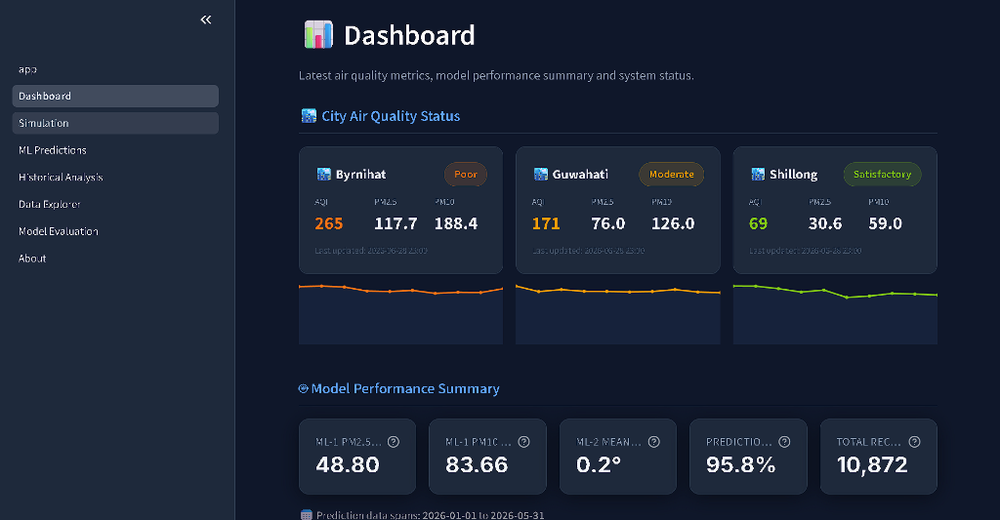
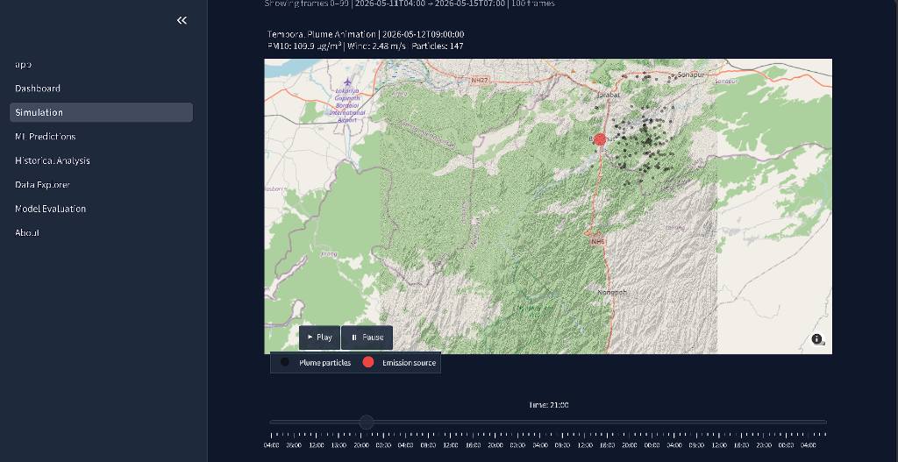
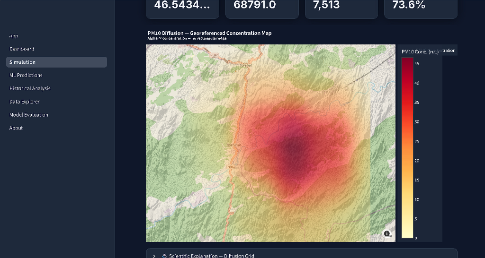
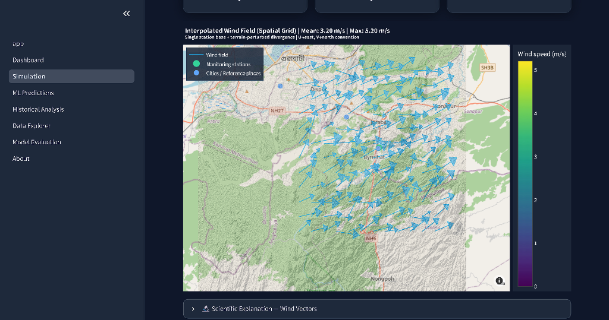
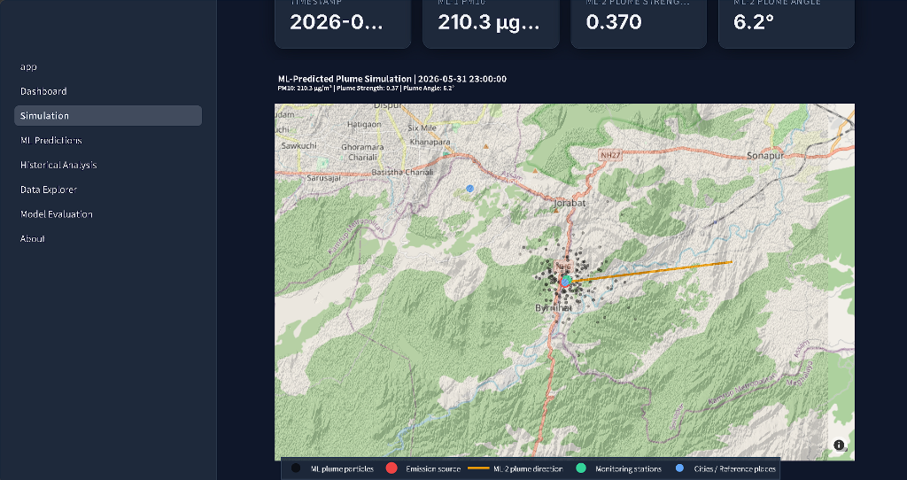

# Byrnihat Air Pollution Research System

## Overview
The **Byrnihat Air Pollution Research System** is a production-grade machine learning framework designed for air quality prediction and atmospheric simulation on the Assam–Meghalaya border. Developed with a rigorous focus on data science and environmental engineering, this system acts as a high-performance simulation and inference engine. It leverages offline-trained machine learning models and spatial calculation algorithms to forecast pollution dispersion and provide real-time analytical insights.

## Academic & Technical Merit
This project heavily emphasizes advanced machine learning and data science workflows, focusing on robust back-end engineering:
- **Multi-Target Machine Learning (ML-1):** Utilizes an `ExtraTreesRegressor` architecture to predict 11 concurrent targets (including multiple pollutants and meteorological components), learning the complex non-linear relationships of the region's micro-climate.
- **Spatial Dispersion Modeling (ML-2):** A dedicated multi-output spatial model that predicts continuous U and V wind vectors for industrial source dispersion mapping.
- **Physical Simulation Engine:** A mathematically rigorous 2D numpy-based Laplacian spatial diffusion model that simulates PM10 atmospheric transport over 150 time steps. It accurately incorporates localized `diffusion_rate` and `decay_rate` parameters to model physical particle behaviors.
- **Optimized Data Pipeline:** Heavy computational operations, data transformations, and model training are processed via an offline pipeline to prevent I/O and CPU bottlenecks during inference.
- **Visualization Layer:** A streamlined, decoupled interface layer built purely to ingest pre-computed ML predictions and georeferenced spatial vectors for scientific review.

## Directory Architecture

```text
byrnihat-air-data/
├── backend/                    # Core mathematical, modeling, and analytical engine
│   ├── analysis_engine.py      # Statistical and analytical logic for observed data metrics
│   ├── data_loader.py          # Unified data ingress and parsing logic (Single Source of Truth)
│   ├── map_builder.py          # Geographic visualizations mapping numerical vectors to coordinates
│   ├── metrics.py              # ML evaluation logic and performance statistical tracking
│   ├── prediction_engine.py    # Formatting, scaling, and handling predictions for the viewing interface
│   └── simulation_engine.py    # 2D Laplacian physics matrices and mathematical plume calculations
├── ml/                         # Machine learning training pipelines and feature engineering scripts
├── models/                     # Saved pre-trained Machine Learning models (.joblib) for inference
├── outputs/                    # Pre-computed analytical results (maps, statistical reports, predictions)
├── data/                       # Raw and processed static inputs (AQICN, NASA POWER, Terrain DEM)
├── app.py                      # Main entry point for the visualization interface
└── pages/                      # Decoupled visualization modules (Contains ZERO business logic)
```

## System Architecture Highlights
1. **Decoupled Machine Learning Core:** Strict separation of the ML pipeline from the visualization layer. The heavy lifting—data ingestion, feature engineering, and model inference—is isolated within the `backend/` and `ml/` environments.
2. **I/O & Inference Optimization:** The framework is optimized by processing compute-heavy training and data manipulation operations offline. The resulting predictions and vectors are ingested by the visualization layer instantly.
3. **Scientific Accuracy in Visualization:** Heatmaps and spatial vectors are mapped using scientifically appropriate color scales (e.g., Viridis for particle density) and strict magnitude normalization, ensuring model outputs are presented accurately.

## Dashboard Features & Visualizations
The system features a decoupled, interactive visualization layer providing comprehensive insights into air quality and simulation data:

- **Main Dashboard**: Displays latest air quality metrics (AQI, PM2.5, PM10) for key locations (Byrnihat, Guwahati, Shillong) alongside model performance summaries and trend lines.
  

- **Temporal Plume Animation**: An interactive map simulation demonstrating the dispersion of plume particles from emission sources over time, complete with playback controls and timeline scrubbing.
  

- **Georeferenced Concentration Map (PM10 Diffusion)**: A spatial heatmap visualizing the relative concentration and diffusion of PM10 across the terrain.
  

- **Interpolated Wind Field (Spatial Grid)**: A detailed vector map illustrating wind speed and direction across the geographical area using interpolated spatial data.
  

- **ML-Predicted Plume Simulation**: Visualizes the machine learning model's predictions for plume direction, strength, and particle spread originating from the emission source.
  

## Installation & Setup

**Prerequisites:**
- Python 3.8+
- [Git](https://git-scm.com/)

**1. Clone the repository**
```bash
git clone https://github.com/Pragyan-Bora59/Byrnihat-Air-Pollution-Research-System.git
cd Byrnihat-Air-Pollution-Research-System
```

**2. Install Dependencies**
Install the required machine learning, scientific computing, and spatial analysis libraries:
```bash
pip install -r requirements.txt
```
*(Core dependencies include `pandas`, `scikit-learn`, `numpy`, and `joblib` for ML operations; alongside `streamlit` and `plotly` for rendering the visualization interface.)*

**3. Run the System Interface**
Launch the interactive visualization engine to review the models' outputs:
```bash
streamlit run app.py
```
This initializes a local interface accessible via your default web browser (usually at `http://localhost:8501`).

## Future Scope
- **Time-Series Forecasting:** Incorporation of recurrent neural network architectures (e.g., LSTMs) or Transformers for advanced temporal forecasting.
- **Live Data Ingestion:** Automating the data pipeline to fetch real-time AQICN and NASA POWER API feeds for live model inference.
- **Expanded Grid Resolution:** Enhancing the spatial resolution and geographical boundaries of the simulation to model broader cross-border environmental impacts.
